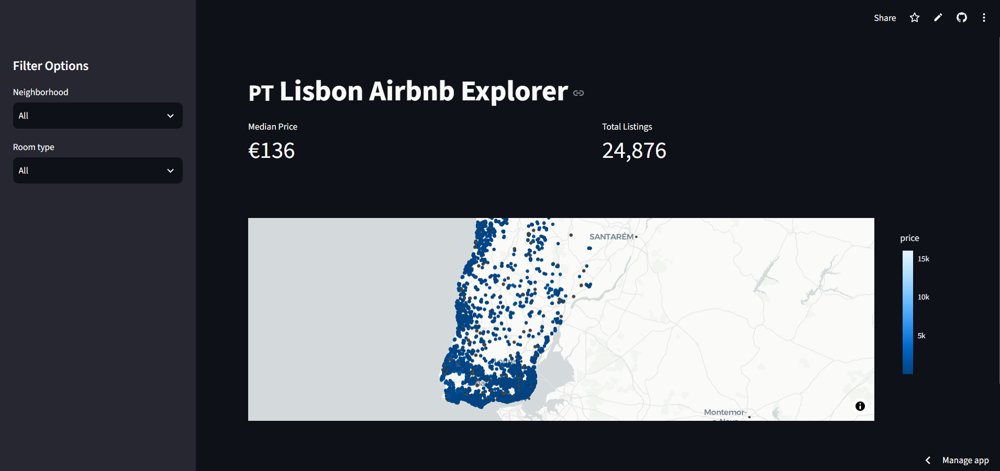
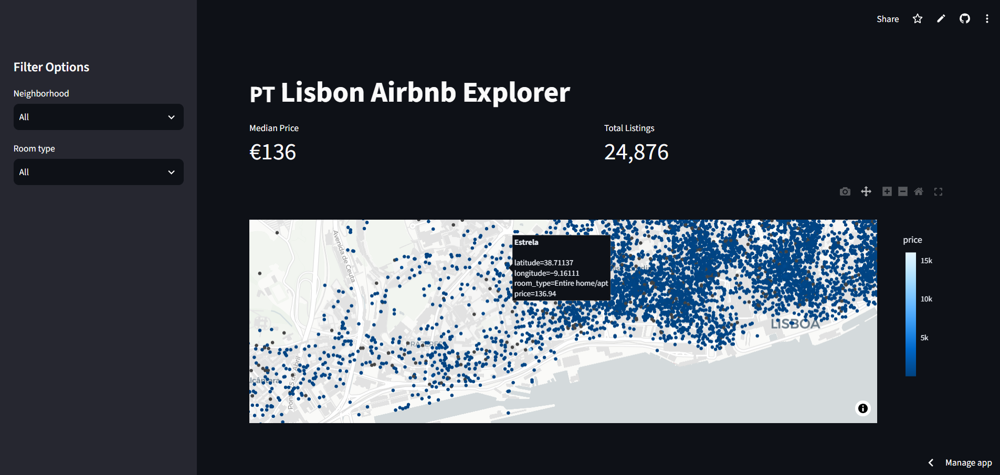
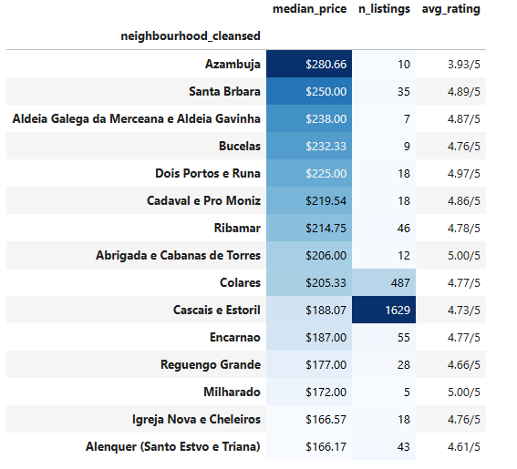
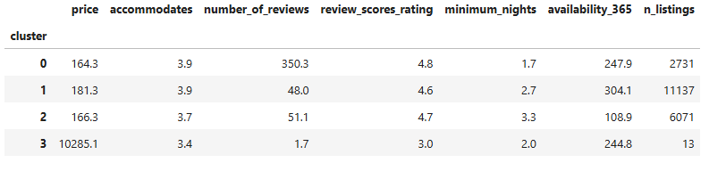

# Lisbon Airbnb Market Analysis

An end-to-end exploratory and statistical analysis of the Airbnb short-term rental market across the **Lisbon district** (city + surrounding municipalities), covering pricing, geography, seasonality, host performance, and market segmentation — with an interactive Streamlit dashboard.

**🔗 Live dashboard:** https://lisbonairbnbanalysis-gmnkls2nywhkgrm7jzvoab.streamlit.app/
**📦 Repo:** https://github.com/gouaderaymen/Lisbon_airbnb_analysis

---

## Business Question

> **What actually determines an Airbnb listing's price in Lisbon, and how should a host or investor use that?**

This project breaks the question down into sub-questions: How is supply distributed across neighborhoods? Does location or property type matter more for price? Is there a seasonal demand pattern? Does superhost status pay off? And do listings cluster into distinct, actionable market segments?

---

## Screenshots

<!--
SCREENSHOT INSTRUCTIONS:
1. Save each image into a `screenshots/` folder in the repo root, using the exact filenames shown
   (e.g. screenshots/overview.png).
2. Once the files exist, the images below will render automatically on GitHub — no other changes needed.
-->

### Live Dashboard

**1. Dashboard overview**



**2. Price map (zoomed in)**



### Analysis Highlights (from the notebooks)

**3. Neighborhood price comparison**



**4. Market segmentation**



---

## Repository Structure

```
Lisbon_airbnb_analysis/
├── data/
│   ├── listings.csv.gz          # Raw Inside Airbnb listings
│   ├── calendar.csv.gz          # Daily availability/price per listing
│   ├── reviews.csv              # Review timestamps
│   ├── listings_clean.csv       # Cleaned listings (output of notebook 02)
│   └── neighborhood_stats.csv   # Aggregated neighborhood stats (output of notebook 03)
├── notebooks/
│   ├── 01_data_acquisition.ipynb
│   ├── 02_cleaning_eda.ipynb
│   ├── 03_geospatia.ipynb
│   ├── 04_seasonality.ipynb
│   ├── 05_statistical_testing.ipynb
│   └── 06_segmentation.ipynb
├── Dashboard/
    └──app.py                        # Streamlit dashboard
├── requirements.txt
└── README.md
```

---

## Data Source

Listings, calendar, and review data from [Inside Airbnb](http://insideairbnb.com/get-the-data.html) for the Lisbon district, scraped June 2026 (**24,876 listings**, **9.09M calendar rows**, **1.89M reviews**).

---

## Methodology & Key Findings

### 01 — Data Acquisition
Loaded and inspected the three raw datasets (listings, calendar, reviews) to confirm scope and schema before cleaning.

### 02 — Cleaning & EDA
- Dropped columns with less than 60% completeness (several fields were 100% empty in this scrape, e.g. `host_since`, `host_response_time`).
- Removed **2,681 listings (~10.8%)** as price outliers (kept between the 1st–99th percentile).
- **Entire homes/apartments make up 75.0%** of the market, private rooms 23.9%, hotel/shared rooms under 1% combined.
- **Santa Maria Maior** (~3,300 listings), **Misericórdia** (~2,350), and **Arroios** (~1,900) are the largest listing hubs.
- Price is heavily right-skewed (peak ~$100–150/night, long tail past $1,000); no strong linear relationship between price and review rating.

### 03 — Geospatial Analysis
- Interactive map and choropleth reveal a clear price gradient across the district.
- Raw median price is highest in small rural municipalities (noisy, low listing counts), but the *economically meaningful* premiums are in established markets: **Cascais e Estoril** ($188/night, n=1,629) and **Colares** ($205/night, n=487).
- Controlling for room type, size, and rating (see notebook 05), central historic parishes carry a genuine premium: **Santa Maria Maior +30.5%, Misericórdia +28.8%, Santo António +24.9%** over baseline (all p < 0.001).

### 04 — Seasonality
- Seasonal decomposition (7-day period) confirms a **weekly occupancy cycle**.
- Monthly review counts used as a demand proxy to visualize activity trends over time.
- *(Available calendar data is a forward 365-day booking window from the scrape date, not a full historical record — no summer-vs-winter occupancy uplift was computed.)*

### 05 — Statistical Testing
- **Room type is the single strongest price driver**: private rooms price ~37% below entire homes, shared rooms ~76% below (t = −56 and −36) — far larger and more significant than any neighborhood effect (max t ≈ 9–10).
- Combined OLS model (room type + neighborhood + accommodates + rating) explains **60.8% of price variance** (R² = 0.608, F = 240.1, p < 0.001, n = 19,953).
- Each additional guest accommodated adds ~14.6% to price; each rating point adds ~9.9% (both highly significant).
- **Superhost status is linked to a statistically significant price difference** (t = 3.76, p = 0.0002), though the exact €/night gap wasn't isolated in this pass.

### 06 — Segmentation (K-Means, k=4)
| Segment | Listings | Avg Price | Reviews | Rating | Profile |
|---|---|---|---|---|---|
| Established performers | 2,731 | $164 | 350 | 4.8★ | Lower price, far more reviews — well-optimized listings |
| Mainstream majority | 11,137 | $181 | 48 | 4.6★ | Largest segment; prices above Cluster 0 but wins far fewer reviews |
| Long-stay niche | 6,071 | $166 | 51 | 4.7★ | Higher minimum stay, lower availability |
| Outliers | 13 | $10,285 | 2 | 3.0★ | Anomalous/ultra-luxury; excluded from typical-price benchmarks |

---

## Answer to the Business Question

Room type is the dominant price lever (a 37–76% swing between entire-home, private, and shared listings), followed by guest capacity and review rating. **Location adds a real but secondary premium**, concentrated in the historic center and a few affluent coastal towns. The market splits into four practical segments — a large, price-competitive middle that under-performs on reviews, a smaller high-performing group that wins on reputation rather than price, a long-stay niche, and a handful of outliers that should never be used to benchmark "typical" pricing.

---

## Tech Stack

- **Python**: pandas, numpy
- **Visualization**: matplotlib, seaborn, plotly, geopandas
- **Statistics / ML**: scipy, statsmodels, scikit-learn (K-Means, StandardScaler)
- **Dashboard**: Streamlit
- **Environment**: Jupyter / JupyterLab

---

## Installation & Usage

```bash
# Clone the repo
git clone https://github.com/gouaderaymen/Lisbon_airbnb_analysis.git
cd Lisbon_airbnb_analysis

# Install dependencies
pip install -r requirements.txt

# Run the notebooks in order (01 → 06) to reproduce the analysis
jupyter lab

# Launch the dashboard locally
streamlit run app.py
```

---

## Author

**Aymen Gouader** — [GitHub](https://github.com/gouaderaymen)